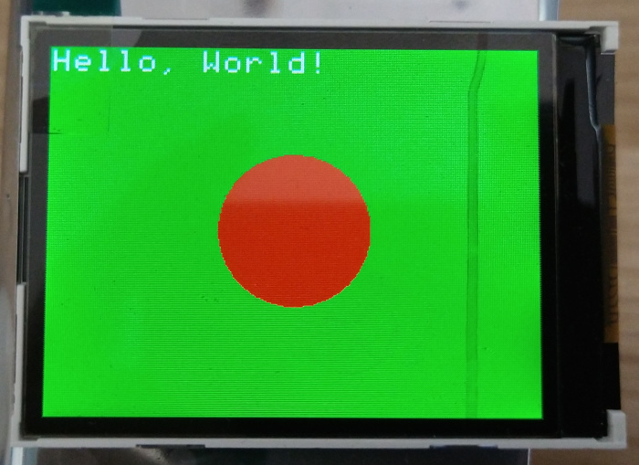
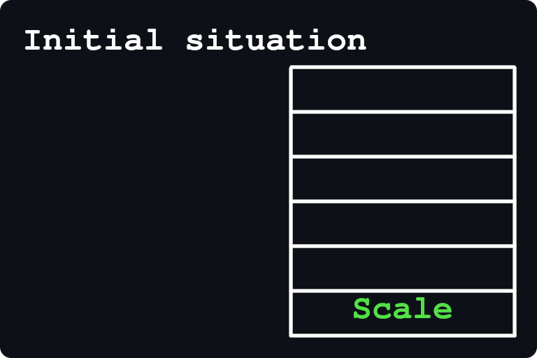
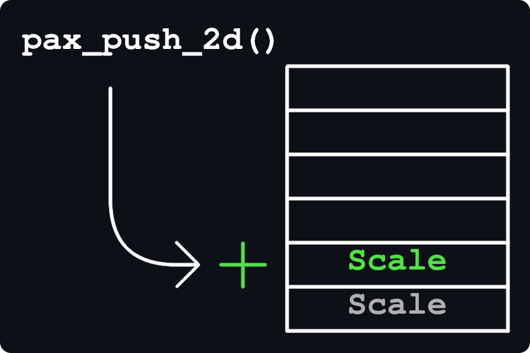
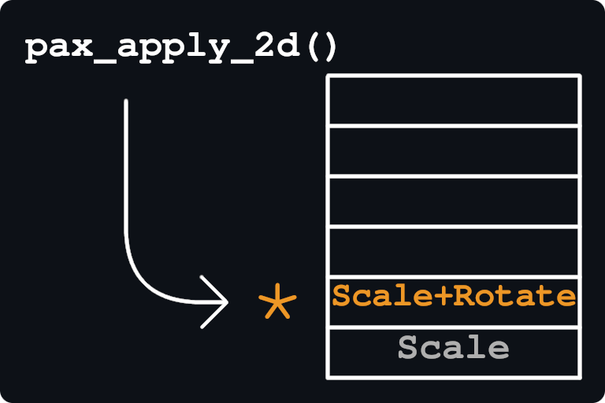
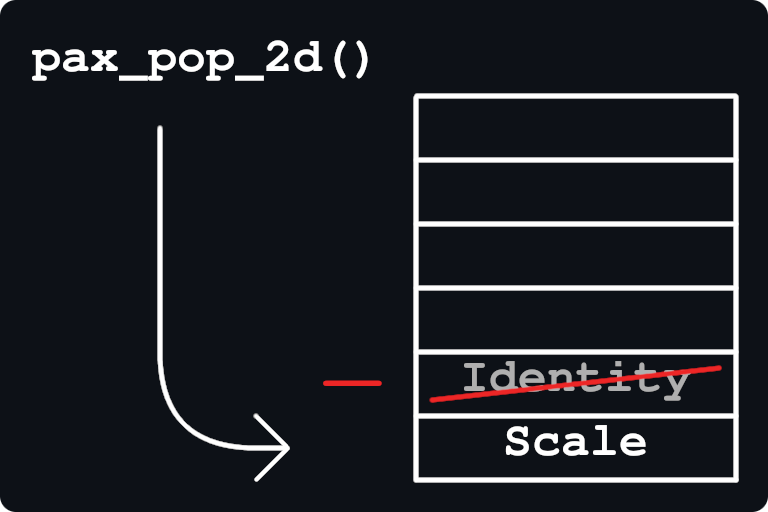

# PAX graphics documentation

The PAX graphics stack is being developed for the [MCH2022 badge](https://bodge.team/docs/badges/mch2022/).
It's goal is to allow anyone to, in C, use a powerful list of drawing features with good optimisation.

This library is the successor of the revised graphics API for [the old badge.team firmware](https://github.com/badgeteam/ESP32-platform-firmware).

## PAX Docs overview
- [Getting started](#getting-started)
- [API overview](#api-overview)
- [API reference](#api-reference)
    - [Setup](#api-reference-setup)
    - [Basic drawing](#api-reference-basic-drawing)
    - [Colors](#api-reference-colors)
    - [Text](#api-reference-text)
- [Advanced API reference](#api-reference-advanced-features)
    - [Clipping](#api-reference-clipping)
    - [Matrix transformations](#api-reference-matrix-transformations)
    - [Shaders](#api-reference-shaders)

# Getting started

Let's get started with a simple example.

In this example, we'll make a green background with a red circle in the middle and some white text in the top left corner.

First, the setup.<br>
In each file you'd like to use PAX graphics in, you'll need to include the `pax_gfx` header: 
```c
// Include the PAX graphics library.
#include <pax_gfx.h>
```

The [`pax_buf_init`](#api-reference-setup) function is used to create a new graphics environment.

Here, we use it with the type PAX_BUF_16_565RGB, which is appropriate for the screen used by the MCH2022 badge.
```c
void my_graphics_function() {
    // Setup.
    pax_buf_t buffer;
    pax_buf_init(&buffer, NULL, 320, 240, PAX_BUF_16_565RGB);
}
```
This tells PAX to create a framebuffer for the screen, which is 320 by 240 pixels in size.

Next, let's make a nice, green background.
You can use [many methods](#api-reference-colors) of picking a color,
but we'll go with [`pax_col_rgb`](#api-reference-colors "Combines RGB channels").
The [`pax_background`](#api-reference-basic-drawing) method fills the background with the desired color, like so:
```c
void my_graphics_function() {
    // Setup.
    pax_buf_t buffer;
    pax_buf_init(&buffer, NULL, 320, 240, PAX_BUF_16_565RGB);
    
    // Green background.
    pax_background(&buffer, pax_col_rgb(0, 255, 0));
}
```
Here's what it looks like if you write it to the screen:


To draw a circle, you use [`pax_draw_circle`](#api-reference-basic-drawing) or [`pax_simple_circle`](#api-reference-basic-drawing)
with a midpoint co-ordinates and the radius:
```c
void my_graphics_function() {
    // Setup.
    pax_buf_t buffer;
    pax_buf_init(&buffer, NULL, 320, 240, PAX_BUF_16_565RGB);
    
    // Green background.
    pax_background(&buffer, pax_col_rgb(0, 255, 0));
    
    // Red circle.
    float midpoint_x = buffer.width  / 2.0; // Middle of the screen horizontally.
    float midpoint_y = buffer.height / 2.0; // Middle of the screen vertically.
    float radius     = 50;                  // Nice, big circle.
    pax_simple_circle(&buffer, pax_col_rgb(255, 0, 0), midpoint_x, midpoint_y, radius);
}
```
Here's what it looks like if you write it to the screen:


Text is a bit more complicated, because you get to pick a font.
However, you can pick any font for now. We'll go with the default (and currently only font) "7x9".<br>
It's point size is 9, which means that a text size of 9 is it's normal look. We'll pick 18.<br>
The [`pax_draw_text`](#api-reference-text) method is used to draw text.
It accepts a font, a point size, a top left corner position and the text to draw:
```c
void my_graphics_function() {
    // Setup.
    pax_buf_t buffer;
    pax_buf_init(&buffer, NULL, 320, 240, PAX_BUF_16_565RGB);
    
    // Green background.
    pax_background(&buffer, pax_col_rgb(0, 255, 0));
    
    // Red circle.
    float midpoint_x = buffer.width  / 2.0; // Middle of the screen horizontally.
    float midpoint_y = buffer.height / 2.0; // Middle of the screen vertically.
    float radius     = 50;                  // Nice, big circle.
    pax_simple_circle(&buffer, pax_col_rgb(255, 0, 0), midpoint_x, midpoint_y, radius);
    
    // White text.
    float text_x     = 0;                   // Top left corner of the screen.
    float text_y     = 0;                   // Top left corner of the screen.
    char *my_text    = "Hello, World!";     // You can pick any message you'd like.
    float text_size  = 18;                  // Twice the normal size for "7x9".
    pax_draw_text(&buffer, pax_col_rgb(255, 255, 255), PAX_FONT_DEFAULT, text_size, text_x, text_y, my_text);
}
```
Here's what it looks like if you write it to the screen:


Next, you'll want to draw this to the screen.<br>
This differs per screen type, but for the MCH2022 badge's screen you use the
[`ili9341_write`](https://github.com/Nicolai-Electronics/esp32-component-spi-ili9341/ "Link on github") method.
```c
void my_graphics_function() {
    // Setup.
    pax_buf_t buffer;
    pax_buf_init(&buffer, NULL, 320, 240, PAX_BUF_16_565RGB);
    
    // Green background.
    pax_background(&buffer, pax_col_rgb(0, 255, 0));
    
    // Red circle.
    float midpoint_x = buffer.width  / 2.0; // Middle of the screen horizontally.
    float midpoint_y = buffer.height / 2.0; // Middle of the screen vertically.
    float radius     = 50;                  // Nice, big circle.
    pax_simple_circle(&buffer, pax_col_rgb(255, 0, 0), midpoint_x, midpoint_y, radius);
    
    // White text.
    float text_x     = 0;                   // Top left corner of the screen.
    float text_y     = 0;                   // Top left corner of the screen.
    char *my_text    = "Hello, World!";     // You can pick any message you'd like.
    float text_size  = 18;                  // Twice the normal size for "7x9".
    pax_draw_text(&buffer, pax_col_rgb(255, 255, 255), PAX_FONT_DEFAULT, text_size, text_x, text_y, my_text);
    
    // Put it on the screen.
    if (ili9341_write(&display, buffer.buf)) {
        ESP_LOGE("my_tag", "Display write failed.");
    } else {
        ESP_LOGI("my_tag", "Display write success.");
    }
}
```
The code we just added is the actual code which writes your beautiful creation to the screen.<br>
If you use a different screen, you'll need to find it's documentation for which type of buffer it wants and how you write to it.

Finally, there's cleanup.<br>
If you don't want to use the buffer you made during setup anymore, you can clean it up with
[`pax_buf_destroy`](#api-reference-setup "Frees any memory assigned to the buffer").
```c
void my_graphics_function() {
    // Setup.
    pax_buf_t buffer;
    pax_buf_init(&buffer, NULL, 320, 240, PAX_BUF_16_565RGB);
    
    // Green background.
    pax_background(&buffer, pax_col_rgb(0, 255, 0));
    
    // Red circle.
    float midpoint_x = buffer.width  / 2.0; // Middle of the screen horizontally.
    float midpoint_y = buffer.height / 2.0; // Middle of the screen vertically.
    float radius     = 50;                  // Nice, big circle.
    pax_simple_circle(&buffer, pax_col_rgb(255, 0, 0), midpoint_x, midpoint_y, radius);
    
    // White text.
    float text_x     = 0;                   // Top left corner of the screen.
    float text_y     = 0;                   // Top left corner of the screen.
    char *my_text    = "Hello, World!";     // You can pick any message you'd like.
    float text_size  = 18;                  // Twice the normal size for "7x9".
    pax_draw_text(&buffer, pax_col_rgb(255, 255, 255), PAX_FONT_DEFAULT, text_size, text_x, text_y, my_text);
    
    // Put it on the screen.
    if (ili9341_write(&display, buffer.buf)) {
        ESP_LOGE("my_tag", "Display write failed.");
    } else {
        ESP_LOGI("my_tag", "Display write success.");
    }
    
    // Cleanup.
    pax_buf_destroy(&buffer);
}
```

# API overview

An overview of the PAX API methods.
The API is split into a few groups:
- [Environment setup](setup.md)
    - How to set up a framebuffer
    - How to apply clipping
    - How to clean up after yourself
- [Basic drawing](drawing.md)
    - Drawing with basic shapes
    - Drawing text
    - Drawing using shaders
- [Colors and color math](colors.md)
    - Creating colors
    - Performing color math
- [Matrix transformations](matrices.md)
    - Applying transformations
    - Using the matrix stack
- [Shaders](shaders.md)
    - Using shaders
    - List of shaders
    - Creating shaders

# API reference

A reference for how to use certain features.

## API reference: Setup

For setting up a buffer, use [`pax_buf_init`](setup.md#buffer-creation):
For the MCH2022 badge, the size is 320x240 and the format is [`PAX_BUF_16_565RGB`](setup.md#buffer-formats).
```c
pax_buf_t buffer;
pax_buf_init(&buffer, memory, width, height, format);
```
If you want, you can use a different type for intermediary buffers (e.g. to store image textures):
- [`PAX_BUF_32_8888ARGB`](setup.md#buffer-formats)
- [`PAX_BUF_16_4444ARGB`](setup.md#buffer-formats)
- [`PAX_BUF_8_2222ARGB`](setup.md#buffer-formats)
- [`PAX_BUF_8_332RGB`](setup.md#buffer-formats)
- [other color formats](setup.md#buffer-formats)

PAX converts colors automatically for you.

When you're done and you won't use a given buffer anymore, you can use [`pax_buf_destroy`](setup.md#buffer-creation):
PAX will automatically free any memory it used for the buffer.
```c
pax_buf_destroy(&buffer);
```

## API reference: Colors

PAX has a small collection of color functions for creating and modifying colors.

For simple colors, [`pax_col_rgb`](colors.md#color-rgb) or [`pax_col_argb`](colors.md#color-rgb) are usually the appropriate functions:
```c
pax_col_t color_0 = pax_col_argb(alpha, red, green, blue);
pax_col_t color_1 = pax_col_rgb (red, green, blue);
```

You can also use [`pax_col_hsv`](colors.md#color-hsv) or [`pax_col_ahsv`](colors.md#color-hsv) to convert HSV to RGB:
```c
pax_col_t color_2 = pax_col_ahsv(alpha, hue, saturation, brightness);
pax_col_t color_3 = pax_col_hsv (hue, saturation, brightness);
```

Otherwise, you can specify it in hexadecimal with the `0xAARRGGBB` format:
```c
pax_col_t color_4 = 0xff7f3f1f;
```

Finally, there's [functions for merging colors](colors.md#color-merging).

## API reference: Basic drawing

In PAX, you can opt to draw shapes in different ways:
- [Simple](drawing.md#simple-drawing) (ignoring [transforms](#api-reference-matrix-transformation) and with a color)
- [Normal](drawing.md#normal-drawing) (with a color)
- [Shaded](drawing.md#shaded-drawing) (with a shader for some specific look), often used for [texturing](#api-reference-shading) (drawing a shape with an image on it)

What variant is best for you?
- You want to draw a simple menu with just some text and basic shapes?
    - Simple (you probably won't need to use transformations, but you could).
- You want to add an image to a shape or otherwise more complex than a single color?
    - Shaded (you can even [make your own shader](shaders.md#making-your-own-shader)).
- Anything else with just one color per shape?
    - Normal.

There are five basic shapes you can draw:
| shape     | simple              | normal            | with shader
| :-------- | :------------------ | :---------------- | :----------
| rectangle | `pax_simple_rect`   | `pax_draw_rect`   | `pax_shade_rect`
| line      | `pax_simple_line`   | `pax_draw_line`   | Not available.
| triangle  | `pax_simple_tri`    | `pax_draw_tri`    | `pax_shade_tri`
| circle    | `pax_simple_circle` | `pax_draw_circle` | `pax_shade_circle`
| arc       | `pax_simple_arc`    | `pax_draw_arc`    | `pax_shade_arc`

Each method here consists of a set of arguments based on the shape:
| shape     | arguments                      | description
| :-------- | :----------------------------- | :----------
| rectangle | `x, y, width, height`          | top left corner of rectangle
| line      | `x0, y0, x1, y1`               | both points that define the line
| triangle  | `x0, y0, x1, y1, x2, y2`       | all three points that define the triangle
| circle    | `x, y, radius`                 | midpoint of circle and radius
| arc       | `x, y, radius, angle0, angle1` | arc from angle0 to angle1 in radians, with midpoint and radius (angles start to the right and go counterclockwise)

### In case you do use shaders

If the method is one of the `pax_shade_` methods, two additional arguments are added after `color`:
- `pax_shader_t *shader, pax_quad_t *uvs` (Except triangle)
    - Circles and arcs behave as though they are a cutout of a rectangle (in terms of UVs).
    - Rectangle UVs 0 -> 3 are the corners: top left, top right, bottom right, bottom left.
- `pax_shader_t *shader, pax_tri_t  *uvs` (Triangle only)
    - Triangles define their UVs per point.

UVs are "texture co-ordinates" in the computer graphics world.
They are floating-point and range from 0 to 1.
It is up to the shader to turn these into pixel co-ordinates for e.g. adding a texture to a shape.

Note: It is acceptable for a rectangle to have a negative width or height. In this case, the UVs still match but with the negative width and height.

## API reference: Text

In PAX, you can use different fonts for text (even though there's only one font called "7x9" for now).
You draw text by using [`pax_draw_text`](text.md#drawing-text):
```c
// Draw some text.
pax_draw_text(&buffer, color, font, font_size, x, y, text);
```
Font is usually [`PAX_FONT_DEFAULT`](text.md#fonts) or another [`PAX_FONT_`](text.md#fonts).<br>
The `font_size` is the line height: 9 by default for the font "7x9".
If this number is 0, the font's default size is used.

You can also calculate the size of a given string with [`pax_text_size`](text.md#text-size):
```c
// Get the size of some text.
pax_vec1_t size = pax_text_size(font, font_size, text);
float text_width  = size.x;
float text_height = size.y;
```
The font_size is the same as the line height for drawing text.

The text features also respect newlines (in the forms of `\n`, `\r\n` or `\r`).

# API reference: Advanced features

The flagship features of PAX are also the more difficult to use, so here's a basic overview:
- There is a [clipping system](#api-reference-clipping), used to isolate drawing to just a small part of the screen,
- There are [matrix transformations](#api-reference-matrix-transformations), used to distort and move around everything you draw,
- Finally, there are [shaders](#api-reference-shaders), used to add an image to a shape or for more complex coloring of shapes.

## API reference: Clipping

When you apply clipping, PAX acts as if the buffer is smaller than it might in reality be.<br>
Clipping can be useful if you want to e.g. draw a big shape but prevent it from overlapping with another area.
Clipping redefines the rectangle in which you can draw.

To apply clipping, use [`pax_clip`](drawing.md#clipping):
```c
// Apply clipping. Automatically fixed negative width and/or height.
pax_clip(&buffer, x, y, width, height);
```

To remove clipping (AKA be able to draw on the entire buffer again), use [`pax_noclip`](drawing.md#clipping):
```c
// Remove clipping.
pax_noclip(&buffer);
```

## API reference: Matrix transformations

Imagine this: You just painstakingly created some vector graphics, but they're too big to fit.
You could re-do all that work, or you could take advantage of transformations.<br>
In PAX, transformations apply to all method starting with `pax_draw_` or `pax_shade_`.
They can be used to re-size, rotate and move shapes around.

First, you need to know what a stack is. <br>
In simple terms, a stack is like a bunch of paper in a box:
You can grab only the top piece of paper, and you can only add paper to the top.<br>
This is like method calls in C: The method you call won't modify your variables unless you want it to.

Let's start with a visual example.
Here, you see an initial situation: a scale matrix has been applied.
<br>
Let's say we want to do something else, but we need this matrix later.
To do this, you'll need to push the matrix stack.

Now, to push the stack, use [`pax_push_2d`](matrices.md#matrix-stack):
```c
// Push the matrix stack. Duplicates the top matrix.
pax_push_2d(&buffer);
```


At this point, it's safe to perform some operation.
Let's say a rotation happened.


But what if you want no transformation but still to remember the old ones?<br>
You use [`pax_reset_2d`](matrices.md#matrix-stack) with the argument `PAX_RESET_TOP`:
```c
// Reset the top matrix.
// A matrix that represents no transformation is also called the 'identity' matrix.
pax_push_2d(&buffer, PAX_RESET_TOP);
```


Finally, you want to use the initial matrix again.
For this, you need to pop the stack.<br>
Use [`pax_pop_2d`](matrices.md#matrix-stack):
```c
// Pop the matrix stack.
pax_pop_2d(&buffer);
```


### Transformation options

Now that you know what the stack is,
you can use [`pax_apply_2d`](matrices.md#applying-matrices) to perform a transformation:
```c
// You can do as many in a row as you'd like.
pax_apply_2d(&buffer, my_perfect_transformation);
```

Let's say you'd like to change the scale of the vector graphics you made.
For this, you use [`matrix_2d_scale`](matrices.md#types-of-matrices):
```c
pax_apply_2d(&buffer, matrix_2d_scale(x_scale, y_scale));
// Draw your things that need to be scaled here.
```

But now, you decide you want it placed elsewhere.
To move around things, use [`matrix_2d_translate`](matrices.md#types-of-matrices):
```c
// By scaling, you are multiplying the size by the given factors.
pax_apply_2d(&buffer, matrix_2d_translate(x_offset, y_offset));
```

There's also the fancy rotation matrix [`matrix_2d_rotate`](matrices.md#types-of-matrices):
```c
// Angle is in radians, positive angles rotate everything counterclockwise.
pax_apply_2d(&buffer, matrix_2d_rotate(angle));
```

## API reference: Shaders

The shader is PAX' most advanced feature.<br>
Internally, they are used for boring things like drawing text, but you can truly turn it into anything you'd like.

The way most users will see shaders is with [`PAX_SHADER_TEXTURE`](shaders.md#built-in-shaders):
```c
pax_shader_t my_texture_shader = PAX_SHADER_TEXTURE(&my_texture);
```

You can also make your own shaders, for example one that shows some nice rainbows:
```c
// The shader callback.
pax_col_t my_shader_callback(pax_col_t tint, int x, int y, float u, float v, void *args) {
    return pax_col_hsv(x / 50.0 * 255.0 + y / 150.0 * 255.0, 255, 255);
}

// The shader object.
pax_shader_t my_shader = {
    .callback          = my_shader,
    .callback_args     = NULL,
    .alpha_promise_0   = false,
    .alpha_promise_255 = true
};
```
The `callback_args` property is passed directly to the selected callback as the `args` parameter.

For more information on how to make and use your own shaders, and how the `alpha_promise_` attributes work, see [shaders.md](shaders.md#making-your-own-shaders).
